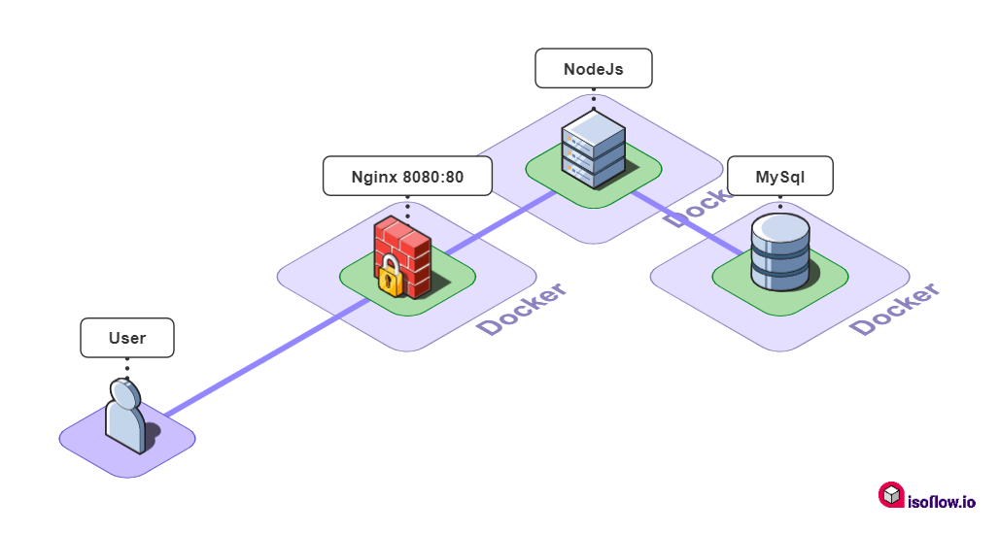
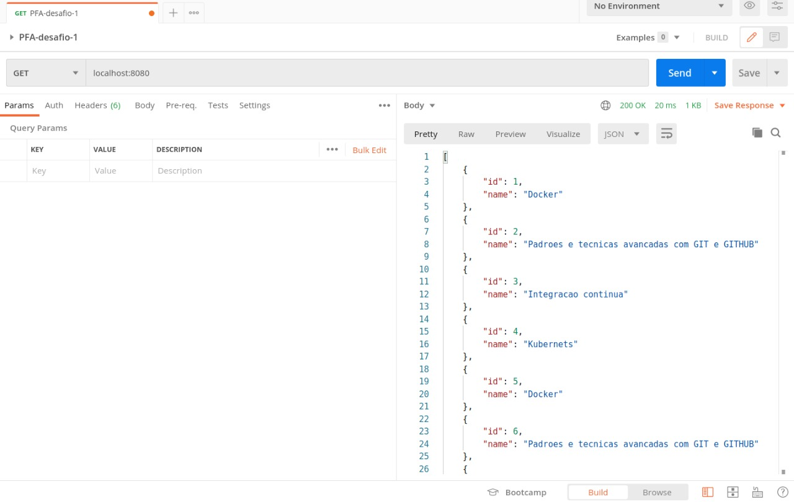

> Provendo dados de um banco mysql através de uma API node e expondo o serviço atrvés de um proxy reverso (nginx)

<p align="center">
  
</p>

# 📘 Infos

**O desafio** 

```
Aproveite o desafio 1 que você criou no PFA, a aplicação com sua linguagem favorita, Nginx e MySQL para aplicar o Docker Compose.

Crie o docker-compose.yaml com 3 serviços, um para cada tecnologia. Você deverá configurar os seguintes pontos:

- O serviço do MySQL não poderá ter um Dockerfile personalizado, é necessário usar diretamente a imagem oficial do MySQL e deverá existir um volume para persistir o banco de dados no projeto, o nome da pasta será dbdata. Deverá usar o entrypoint-initdb.d para já criar um banco e popular dados no banco de dados padrão.

- O serviço da sua linguagem favorita deverá continuando a listar dados através da WEB vindo do MySQL. Antes do container iniciar ele deverá verificar se o MySQL já está pronto para conexão, sugerimos usar o Dockerize para fazer esta verificação.

- O serviço do Nginx continuará sendo um proxy reverso para a sua aplicação da linguagem favorita e deverá expor a porta 8000 para acessar a aplicação no browser. Este serviço deverá iniciar somente quando o da sua aplicação da linguagem favorita for iniciado e deverá ser reiniciado automaticamente caso a aplicação da linguagem favorita não esteja rodando ainda.

- Os serviços do MySQL e da linguagem favorita devem ter uma rede compartilhada que o Nginx não enxergue e linguagem favorita e Nginx devem ter uma rede compartilhada que o MySQL não enxergue.

Para corrigir seu projeto rodaremos apenas o comando "docker-compose up", tudo já deve ser levantado e estar disponível ao fazer isto, teste bastante isto antes de enviar o desafio para correção.
```


**Como rodar**

Executar o comando abaixo com o terminal no mesmo diretório que o arquivo docker-compose.yaml (raiz do projeto):

```bash
docker compose up
```


# 💻 Resultado esperado

<p align="center">
  
</p>